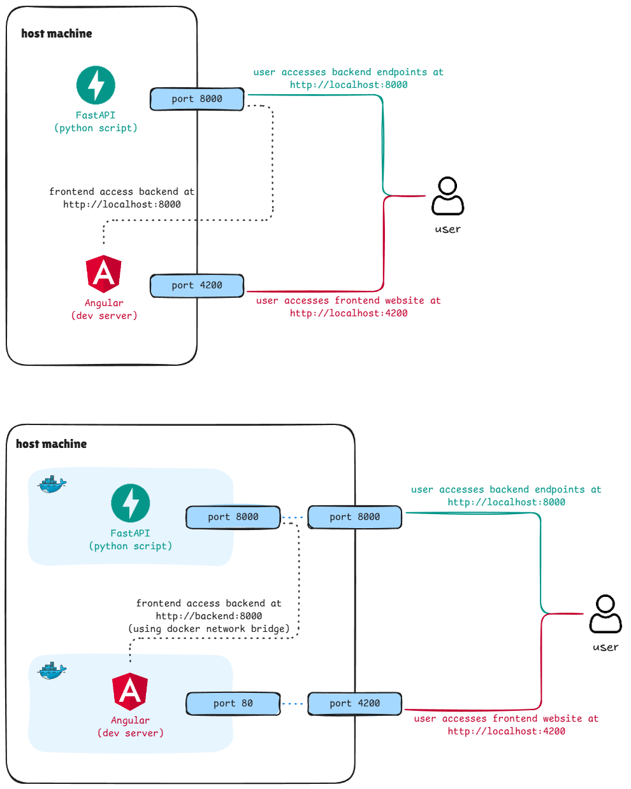

# Architecture
This document explain the architecture of the application.

## Local Development
### Backend
The Fast API backend runs on port 8000, this is defined inside of the [app.py](../backend/src/app.py) script. When you run `python src/app.py` in the `backend` directory, then Python will create a FastAPI server at `http://localhost:8000`

### Frontend
The frontend runs on port 4200, this is not explicitly defined anywhere, but is the default port used by Angular. When you run `ng serve` in the `frontend` directory, then Angular will create an Angular app at `http://localhost:4200`

### API Routing
The Angular frontend is hosted on an Angular development server running locally. The frontend interacts with the backend using http requests, which it does to end points formatted as `/api/*`. The [proxy.conf.json](../frontend/proxy.conf.json) file is used to tell the Angular development server to forward any requests to `/api/*` to `http://localhost:8000/*` (the backend server). This proxy configuration prevents CORS (Cross-Origin Resource Sharing) issues that would occur if the frontend tried to directly request resources from a different port.

### Data
Todo

## Docker Compose
### Backend
The Fast API backend runs on port 8000 of the container, the [Dockerfile](../frontend/Dockerfile) exposes this port to the host machine, the [docker-compose.yml](../docker-compose.yml) file maps port 8000 of the host machine to port 8000 of the container. As a result, a FastAPI server is launched at `http://localhost:8000` (same as local development).

### Frontend
The Angular frontend is hosted inside of a container using an `nginx` server. The nginx.conf file configures the `nginx` server to make the web app available on port 80. The Dockerfile exposes this port to the host machine, the [docker-compose.yml](../docker-compose.yml) file maps port 4200 to port 80 of the container. As a result, the Angular webapp can be reached at `http://localhost:4200` (same as local development).

### API Routing
The [docker-compose.yml](../docker-compose.yml) file defines two services (the backend and the frontend). These are (by default) two seperate containers that are isolated from one another. However we want the frontend to be able to make requests to the backend, so a docker network bridge is used to connect these two containers. Now the frontend container can access the backend container using `http://backend:<port_number>` (where you can replace `<port_number>` with the desired port number).

The Angular frontend interacts with the backend using http requests, which it does to end points formatted as `/api/*`. The nginx.conf is used to tell the nginx server to forward any request to `/api/*` to `http://backend:8000/*` (the backend server).

The docker-compose file and the port mappings have been chosen in such a way that the application (frontend & backend) behave the same whether you are running it locally or inside of the docker containers: you can test the backend using `http://localhost:8000` and the frontend using `http://localhost:4200`.

If you want to run a local instance of the application and a dockerized instance of the application you can change the mappings inside of the [docker-compose.yml](../docker-compose.yml) file. You can change the port mapping of the backend and frontend to whatever you want.  Once the mapping has been changed you can now reach the frontend on the specified new frontend-port, and you can test the backend on the specified new backend-port. There is no need to change any of the code of the http requests or of the nginx configurations, the nginx server of the frontend will still use a proxy to forward all requests to `http://backend:8000/*`, which does not use the port mapping; port mapping is only for host machine access to the containers, the docker network bridge uses the ports defined by the Dockerfiles.

### Data
Todo
